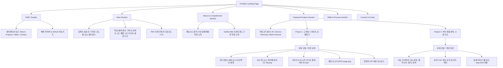

# [PRD] 바닐라 자바스크립트 기반 개인 포트폴리오 웹사이트 요구사항 정의서
**Product Requirements Document (PRD): Personal Portfolio Web Application**

---

## 1. 문서 개요 (Document Overview)

| 항목 | 내용 |
| :--- | :--- |
| **문서명** | 바닐라 자바스크립트 기반 개인 포트폴리오 웹사이트 PRD |
| **작성 일자** | 2026년 9월 23일 |
| **작성 대상** | `profile` 디렉토리 내 프로젝트 산출물(이마트 기획안, 인터랙티브 맵 등) 통합 포트폴리오 |
| **기술 환경** | Vanilla HTML5, Vanilla CSS3, Vanilla JavaScript (ES6+) |
| **데이터 환경** | **No-Database (정적 JSON / 클라이언트 인메모리 데이터 객체 구조)** |
| **문서 상태** | Draft -> Confirmed (기획 승인 단계) |

---

## 2. 프로젝트 배경 및 목적 (Background & Objectives)

### 2.1 배경
- 신세계 2기 과정 및 개인 프로젝트를 통해 도출된 핵심 성과물(서비스 기획, 마케팅 에셋, 웹 프론트엔드 지도 애플리케이션)이 로컬 및 개별 웹페이지로 분산되어 있음.
- **주요 보유 산출물**:
  1. **고래잇 × 이마트 보물찾기 프로젝트**: 다문화 가정 및 미취학 아동을 타깃으로 한 게이미피케이션(Gamification) 오프라인 공간 기획안(PDF), 6단 스토리텔링 카드뉴스(`01.png`~`06.png`), 대형 매장 안내 포스터(`image.png`), 1인칭 RPG POV 숏폼 비디오(`5t.mp4`), 웹 보고서(`e.html`).
  2. **부산 생활 편의 시설 지도 웹앱**: Leaflet 및 MarkerCluster 기반의 카테고리/지역 필터링, 키워드 검색, CSV 동적 업로드, 카카오/네이버 지도 연동 프론트엔드 웹 애플리케이션(`map.html`).
- 이 산출물들을 단편적으로 나열하는 것이 아니라, **"문제 정의부터 기획, 비주얼 에셋 디렉팅, 프론트엔드 개발 구현까지 완결할 수 있는 올라운더 인재"**의 면모를 드러낼 수 있는 통합 포트폴리오 웹사이트 구축이 필요함.

### 2.2 목적
- **직관적 역량 검증**: 채용 담당자나 동료 개발자가 3분 이내에 기획력(논리적 문제해결)과 개발력(인터랙티브 웹 구현)을 체감할 수 있도록 구성.
- **경량화 및 독립성 극대화**: 서버나 데이터베이스(DB) 의존성 없이, GitHub Pages 등 정적 호스팅 환경에서 100% 독립 실행 가능한 고성능 바닐라 자바스크립트 구조 구현.
- **인터랙티브 미디어 쇼케이스**: 정적 텍스트 위주 이력서를 탈피하여, 카드뉴스 슬라이더, 비디오 인라인 재생, 줌 모달, 인터랙티브 데모 프리뷰 제공.

---

## 3. 핵심 페르소나 및 사용자 시나리오 (Target Persona & Journey)

### 3.1 페르소나
- **IT 기업 기획/개발 채용 담당자 (Tech Recruiter & Hiring Manager)**:
  - 수많은 지원자의 포트폴리오를 빠르게 스캐닝함 (평균 1~2분 소요).
  - "진짜 본인이 기획하고 구현한 것인가?", "문제 해결 과정이 논리적인가?", "UI/UX 감각과 코드 구조화 능력이 있는가?"를 중점 평가.

### 3.2 사용자 여정 (User Journey)
1. **1단계 (3초 인지 - Hero)**: 직관적인 헤드라인과 핵심 역량 뱃지(서비스 기획, Vanilla JS, UI/UX, 공간 경험 디자인) 확인.
2. **2단계 (30초 탐색 - 필터 및 요약)**: 기획(Planning)과 개발(Development) 탭 또는 전체 보기로 관심 분야 프로젝트를 필터링.
3. **3단계 (2분 심층 검증 - 프로젝트 상세 모달/인라인 뷰어)**:
   - *이마트 프로젝트*: 기획 배경(AS-IS / TO-BE), 6단 카드뉴스 슬라이드 조작, 숏폼 영상 시청, 매장 포스터 확인, 성과 지표(KPI) 확인.
   - *부산 지도 프로젝트*: 기술 스택(Leaflet, OpenData, Cluster), 구현 핵심 로직, 라이브 데모 연동 확인.
4. **4단계 (행동 전환 - Contact & Links)**: GitHub, 이메일, 산출물 링크를 통한 연락 및 채용 검토.

---

## 4. 시스템 아키텍처 및 기술 원칙 (Architecture & Constraints)

### 4.1 기술 스택
- **구조 (Structure)**: Semantic HTML5 (접근성 및 SEO 최적화)
- **스타일 (Styling)**: Modern Vanilla CSS (CSS Grid, Flexbox, CSS Custom Properties/변수 활용, Glassmorphism, 다크/라이트 무드 대응)
- **로직 (Logic)**: Pure Vanilla JavaScript (ES6+ Class or Modular Object Pattern, No jQuery, No Frameworks)
- **데이터베이스 (Database)**: **사용 안 함 (No DB)**.
  - 모든 프로젝트 데이터, 소개 정보, 미디어 경로는 `data/portfolio-data.js` 파일에 구조화된 JavaScript 객체(JSON 형태)로 관리.
- **호스팅/실행 환경**: 별도 빌드 단계(No Webpack, No Vite) 없이 브라우저에서 `index.html` 단독 실행 및 GitHub Pages 배포 지원.

### 4.2 자원 및 에셋 맵핑 (Asset Mapping)
현재 `profile` 폴더 내 기존 리소스를 포트폴리오 에셋으로 100% 매핑하여 활용:
```text
profile/
├── index.html                   # 메인 포트폴리오 페이지
├── css/
│   └── style.css                # 전체 디자인 시스템 및 반응형 CSS
├── js/
│   ├── portfolio-data.js        # [No-DB] 프로젝트 전체 정적 데이터 객체
│   ├── app.js                   # 메인 렌더링, 필터링, 탭, 스크롤 인터랙션
│   ├── modal.js                 # 프로젝트 상세 팝업 및 미디어 뷰어
│   └── media-slider.js          # 카드뉴스 슬라이더 및 비디오 컨트롤
├── 01.png ~ 06.png              # [에셋] 이마트 카드뉴스 1~6편
├── image.png                    # [에셋] 이마트 매장 입구 포스터 (9:16)
├── 5t.mp4                       # [에셋] 1인칭 RPG POV 쇼츠 영상
├── 이마트 보물찾기 프로젝트 기획안.pdf # [에셋] 기획서 원문 PDF 다운로드/뷰어
├── e.html                       # [참조] 이마트 홍보 실행 기획서 원본 웹
└── map.html                     # [참조/데모] 부산 생활 편의 시설 지도 웹앱
```

---

## 5. 포트폴리오 정보 구조도 (Information Architecture, IA)



---

## 6. 기능 상세 요구사항 명세 (Functional Requirements)

### 6.1 FR-01: 정적 데이터 렌더링 시스템 (No-DB Engine)
- **요구사항**: `portfolio-data.js`에 정의된 JS 배열/객체 데이터를 읽어와 DOM API(`document.createElement`, 템플릿 리터럴)를 통해 카드 컴포넌트를 동적으로 생성해야 한다.
- **데이터 필드 규격**:
  - `id`: 고유 식별자 (`emart-treasure`, `busan-map` 등)
  - `category`: `planning` | `frontend` | `all`
  - `title`: 프로젝트 명
  - `subtitle`: 한 줄 요약
  - `period`: 수행 기간 및 소속
  - `tags`: 주요 스킬/키워드 태그 배열
  - `thumbnail`: 대표 이미지
  - `highlights`: 3대 핵심 성과 요약 (불릿 포인트)
  - `detail`:
    - `problemDefinition`: 해결하고자 한 핵심 문제(AS-IS)
    - `solution`: 도출한 핵심 해결책(TO-BE)
    - `kpis`: 정량적 목표 지표
    - `assets`: 카드뉴스 배열, 영상 파일, 포스터 파일, PDF 링크 등
    - `techStack`: 사용 기술 및 도구

### 6.2 FR-02: 프로젝트 카테고리 필터링 (Tab & Category Filter)
- **요구사항**: 상단 필터 탭(`전체`, `서비스 기획/마케팅`, `웹 프론트엔드`) 클릭 시 페이지 새로고침 없이 바닐라 JS로 카드를 필터링하여 부드러운 페이드 애니메이션과 함께 표시한다.
- **기본값**: `전체 (All)` 활성화.

### 6.3 FR-03: 이마트 보물찾기 - 6단 카드뉴스 인터랙티브 뷰어
- **요구사항**:
  - `01.png`부터 `06.png`까지의 카드뉴스를 슬라이더 형태로 감상할 수 있는 컴포넌트 제공.
  - `이전(<)`, `다음(>)` 버튼 클릭 및 인디케이터(도트) 클릭 시 이미지 전환.
  - 현재 페이지 번호 및 각 장의 스토리 캡션(예: "01. 인지: 매장 방문", "02. 획득: 보물지도 수령" 등) 동적 출력.
  - 키보드 방향키(좌/우) 탐색 지원.

### 6.4 FR-04: 1인칭 RPG POV 쇼츠 비디오 플레이어
- **요구사항**:
  - `5t.mp4` 비디오를 9:16 모바일 비율의 목업 프레임 내에서 재생.
  - 게임 UI(체력바 HP, 레벨 표시)를 상단에 오버레이하여 기획 의도(RPG 게이미피케이션)를 극대화.
  - 자동재생(음소거), 재생/일시정지 토글, 전체화면 버튼 지원.

### 6.5 FR-05: 4단계 매장 포스터 라이트박스 뷰어
- **요구사항**:
  - `image.png` 포스터를 클릭 시 고해상도 라이트박스 팝업으로 확대 표시.
  - 포스터 내 4단계 참여 규칙(지도 받기 → 색깔 찾기 → 식재료 담기 → 스탬프 찍기)에 대한 기획 의도 툴팁/설명 제공.

### 6.6 FR-06: 부산 생활 편의 시설 지도 - 라이브 프리뷰 & 기술 쇼케이스
- **요구사항**:
  - `map.html`의 주요 핵심 기능(Leaflet 인터랙티브 지도, 마커 클러스터링, 다중 카테고리 필터링, CSV 업로드, 길찾기 딥링크)을 카드 형태로 구조화하여 설명.
  - 포트폴리오 내에서 `map.html`을 `iframe`으로 직접 조작해보거나, 새 창으로 열 수 있는 "라이브 데모 실행" 버튼 제공.

### 6.7 FR-07: 프로젝트 상세 모달 (Deep-Dive Modal System)
- **요구사항**:
  - 각 프로젝트 카드의 "자세히 보기" 클릭 시 배경 딤(Dim) 처리와 함께 상세 모달 오픈.
  - URL 해시 변경(예: `#project-emart`)을 지원하여 브라우저 뒤로가기 버튼 지원.
  - ESC 키 또는 모달 바깥 영역 클릭 시 닫기.

### 6.8 FR-08: 기획서 PDF 다운로드 및 외부 웹 링크 연동
- **요구사항**:
  - `이마트 보물찾기 프로젝트 기획안.pdf`를 바로 다운로드하거나 새 탭에서 열람할 수 있는 버튼 제공.
  - 원본 홍보 웹페이지(`e.html`) 및 설문 참여 링크로 원활히 이동할 수 있는 바로가기 제공.

---

## 7. UI/UX 디자인 시스템 및 비주얼 가이드라인

### 7.1 비주얼 컨셉: "Modern Tech Minimal & Editorial Elegance"
- 신뢰감을 주는 딥 네이비(신세계/이마트 연계 아이덴티티 수용)와 활력 있는 인디고/앰버 포인트를 조합.
- 모던 글래스모피즘(Backdrop blur), 은은한 카드 섀도우, 둥근 모서리(Border-radius 16px~24px)로 트렌디한 포트폴리오 경험 제공.

### 7.2 디자인 토큰 (CSS Custom Properties)
```css
:root {
  /* Brand Colors */
  --bg-primary: #0F172A;       /* Slate 900 */
  --bg-secondary: #1E293B;     /* Slate 800 */
  --bg-card: rgba(30, 41, 59, 0.7);
  --bg-card-hover: rgba(51, 65, 85, 0.8);
  
  --text-primary: #F8FAFC;     /* Slate 50 */
  --text-secondary: #94A3B8;   /* Slate 400 */
  --text-accent: #38BDF8;      /* Sky 400 */
  
  --accent-emart: #FFB81C;     /* Emart Yellow */
  --accent-point: #6366F1;     /* Indigo 500 */
  --accent-green: #10B981;     /* Emerald 500 */
  --accent-red: #EF4444;       /* Red 500 */
  
  /* Layout & Spacing */
  --max-width: 1200px;
  --radius-sm: 8px;
  --radius-md: 16px;
  --radius-lg: 24px;
  
  /* Shadows & Blur */
  --glass-blur: blur(12px);
  --card-border: 1px solid rgba(255, 255, 255, 0.08);
  --card-shadow: 0 10px 30px -10px rgba(0, 0, 0, 0.5);
}
```

### 7.3 반응형 브레이크포인트 (Responsive Breakpoints)
- **Mobile**: < 768px (1열 카드 배치, 모바일 전용 햄버거/바텀 바, 비디오 및 슬라이더 터치 친화적 UI)
- **Tablet**: 768px ~ 1024px (2열 그리드 배치)
- **Desktop**: > 1024px (최대 1200px 컨테이너, 2열 분할 상세 뷰, 좌우 스플릿 레이아웃)

---

## 8. 데이터 스키마 정의 (No-DB / `portfolio-data.js`)

포트폴리오의 모든 데이터는 아래 스키마에 따라 독립적인 JS 파일로 관리됩니다:

```javascript
// js/portfolio-data.js
const PORTFOLIO_DATA = {
  profile: {
    name: "프로젝트 기획 & 프론트엔드 개발자",
    role: "Service Planner & Frontend Developer",
    tagline: "문제를 발견하고 기획하며, 인터랙티브 웹으로 직접 구현하는 올라운더",
    summary: "오프라인 공간 경험의 문제점을 게이미피케이션으로 혁신한 서비스 기획부터, Leaflet 기반 대용량 상권 지도 웹 애플리케이션 프론트엔드 개발까지 완결성 있는 프로덕트를 만듭니다.",
    stats: [
      { label: "서비스 기획안", value: "1건 (이마트 콜라보)" },
      { label: "프론트엔드 웹앱", value: "2건 (지도/리포트)" },
      { label: "제작 홍보/시각 에셋", value: "8+ 종" }
    ],
    skills: {
      planning: ["문제 정의 (AS-IS / TO-BE)", "페르소나 & 여정 맵핑", "게이미피케이션 프로모션", "KPI 수립 & 운영 체크리스트"],
      development: ["Vanilla JavaScript (ES6+)", "Semantic HTML5 / Modern CSS", "Leaflet GIS & MarkerCluster", "정적 데이터 파싱 (CSV/JSON)"],
      design: ["카드뉴스 스토리텔링", "숏폼 비디오 디렉팅", "VMD 포스터 기획"]
    }
  },
  projects: [
    {
      id: "emart-treasure-hunt",
      category: "planning",
      featured: true,
      badge: "신세계 이마트 콜라보레이션 기획",
      title: "고래잇 × 이마트 식재료 탐험 보물찾기",
      subtitle: "다문화 가정과 미취학 아동을 위한 게이미피케이션 오프라인 쇼핑 경험 혁신",
      period: "2026.09 (신세계 2기)",
      client: "신세계 / 이마트 x 고래잇",
      tags: ["서비스 기획", "게이미피케이션", "공간 경험 디자인", "카드뉴스", "숏폼 비디오"],
      thumbnail: "01.png",
      summaryPoints: [
        "언어 장벽이 있는 다문화 가정 주부(아인)와 5세 아동(푸이)을 위한 직관적 컬러·픽토그램 쇼핑 퀘스트 설계",
        "지루한 장보기를 '불고기 레시피 재료 탐험' RPG로 전환하여 매장 체류시간(42분➔68분) 및 객단가(+18.5%) 증대 도모",
        "6단 SNS 카드뉴스, 매장 VMD 4단계 포스터, 1인칭 RPG POV 숏폼 영상 등 온·오프라인 통합 홍보 에셋 기획 및 제작"
      ],
      pdfPath: "이마트 보물찾기 프로젝트 기획안.pdf",
      liveWebPath: "e.html",
      surveyUrl: "https://joo17hi08-sudo.github.io/fnda21/01/web1.html",
      assets: {
        cardnews: [
          { src: "01.png", step: "01. 인지", title: "이마트 보물찾기 탐험의 시작", desc: "고래잇과 함께하는 즐거운 주말 장보기 모험 출발!" },
          { src: "02.png", step: "02. 획득", title: "매장 입구 보물지도 수령", desc: "오늘의 요리 테마(불고기)와 탐험 동선 확인" },
          { src: "03.png", step: "03. 탐색", title: "컬러 사인을 따라 식재료 찾기", desc: "육류(적색), 채소(녹색) 코너에서 보물 식재료 쏙!" },
          { src: "04.png", step: "04. 미션", title: "스탬프 퀘스트 완료", desc: "아이의 성취감을 자극하는 4개 코너 스탬프 달성" },
          { src: "05.png", step: "05. 보상", title: "한정판 리워드 & 쿠폰 획득", desc: "귀여운 고래잇 키링, 스티커 및 5,000원 할인 쿠폰 지급" },
          { src: "06.png", step: "06. 예고", title: "다음 주 보물 테마 커밍순", desc: "다음 주 새로운 요리 실루엣 예고로 지속적 재방문 유도" }
        ],
        poster: {
          src: "image.png",
          ratio: "9:16",
          title: "글로벌 공통 언어 컬러 & 픽토그램 매장 포스터",
          steps: ["1. 보물지도 받기", "2. 색깔 찾기", "3. 보물 식재료 쏙!", "4. 스탬프 찍기"]
        },
        video: {
          src: "5t.mp4",
          ratio: "9:16",
          title: "1인칭 POV RPG 퀘스트 숏폼 영상",
          desc: "체력바(HP), 레벨, 퀘스트 알림 UI를 오버레이한 30초 릴스/쇼츠 바이럴 영상"
        }
      },
      kpis: [
        { metric: "온라인 도달 목표", value: "150,000+", desc: "인스타그램/릴스/틱톡 통합" },
        { metric: "미션 완료율", value: "65%", desc: "오프라인 지도 수령 대비" },
        { metric: "가족 체류시간", value: "42분 ➔ 68분", desc: "+61.9% 매장 체류 증대" },
        { metric: "고객 객단가", value: "+18.5%", desc: "연관 식재료 묶음 판매 효과" }
      ]
    },
    {
      id: "busan-convenience-map",
      category: "frontend",
      featured: true,
      badge: "웹 프론트엔드 & GIS 시각화",
      title: "부산 생활 편의 시설 통합 인터랙티브 지도",
      subtitle: "Leaflet 및 MarkerCluster 기반의 상권/편의시설 검색 및 길찾기 웹 서비스",
      period: "2026.09",
      tags: ["Vanilla JS", "Leaflet GIS", "MarkerCluster", "동적 CSV 파싱", "반응형 웹"],
      thumbnail: "map_files/preview.png", // 대체 프리뷰
      liveWebPath: "map.html",
      summaryPoints: [
        "부산시 내 편의점, 대형마트, 백화점, 헬스장 등 생활 밀착형 25+ 개 이상 시설의 좌표 및 상세정보를 반응형 지도에 시각화",
        "대량 마커 렌더링 성능 저하를 방지하기 위해 Leaflet.markercluster 알고리즘 도입 및 커스텀 원형 뱃지 스타일 적용",
        "카테고리별 원클릭 필터, 부산 구/군 드롭다운 필터, 실시간 텍스트 검색 및 사용자 CSV 파일 드래그앤드롭 동적 렌더링 지원",
        "각 매장 상세 팝업에서 카카오맵 및 네이버 지도 길찾기 딥링크를 원클릭으로 호출하는 O2O 내비게이션 연계"
      ],
      techSpecs: [
        { title: "지도 렌더링", tech: "Leaflet v1.9.4 + OpenStreetMap Tiles" },
        { title: "클러스터링", tech: "Leaflet.markercluster v1.4.1" },
        { title: "데이터 연동", tech: "HTML5 FileReader API 기반 CSV 동적 파싱" },
        { title: "UI 스타일링", tech: "Tailwind CSS + 커스텀 인터랙션 CSS" }
      ]
    }
  ]
};
```

---

## 9. 구현 및 테스트 마일스톤 (Milestones & Roadmap)

| 단계 | 주요 작업 내용 | 산출물 | 완료 기준 |
| :--- | :--- | :--- | :--- |
| **Phase 1: 기획 및 데이터 설계** | • PRD 작성 및 디렉토리 구조 확정<br>• `portfolio-data.js` 데이터 객체 정의 | `PRD.md`, `js/portfolio-data.js` | 사용자 승인 및 데이터 스키마 완성 |
| **Phase 2: 코어 레이아웃 & 스타일링** | • `index.html` 시맨틱 뼈대 작성<br>• 모던 다크/글래스모피즘 CSS 구축<br>• Hero / About / Projects 반응형 그리드 | `index.html`, `css/style.css` | 모바일/데스크톱 반응형 뷰포트 정합성 통과 |
| **Phase 3: 인터랙티브 컴포넌트 구현** | • 카테고리 필터링 로직 구현<br>• 6단 카드뉴스 슬라이더 컴포넌트(`01.png`~`06.png`)<br>• 1인칭 RPG 비디오 플레이어(`5t.mp4`)<br>• 모달 상세 팝업 시스템 | `js/app.js`, `js/media-slider.js`, `js/modal.js` | 슬라이더 좌우 탐색, 비디오 재생, 모달 열기/닫기 정상 동작 |
| **Phase 4: 프로젝트 통합 & 연동** | • PDF 기획서 다운로드 링크 연결<br>• `map.html` 라이브 데모 iframe/링크 연동<br>• `e.html` 홍보 기획서 링크 연동 | 프로젝트 전체 연결 | 링크 및 미디어 파일 404 없이 100% 로드 |
| **Phase 5: 검증 및 브라우저 테스트** | • 로컬 브라우저 크로스체크<br>• 콘솔 에러 0건 확인<br>• 최종 사용자 검수 및 Walkthrough 작성 | 최종 포트폴리오 산출물 | 사용자 피드백 반영 완료 |

---

## 10. 기대 효과 (Expected Outcomes)

1. **차별화된 포트폴리오 정체성 확립**:
   - 단순 코더가 아닌, 비즈니스 가치(이마트 오프라인 체류시간 증대)를 기획하고 이를 웹 프론트엔드 프로덕트로 실현하는 차별화된 역량 증명.
2. **서버리스 / 100% 바닐라 안정성**:
   - DB 서버나 외부 API 키 없이도 영구적으로 온전하게 작동하며, 포트폴리오 전달 시 안정적인 열람 보장.
3. **높은 몰입도의 인터랙티브 경험**:
   - 단순 스크린샷 캡처 나열이 아닌, 실제 카드뉴스 넘겨보기, 숏폼 영상 감상, 지도 앱 조작 경험을 하나의 포트폴리오 웹사이트에서 한 번에 제공.
